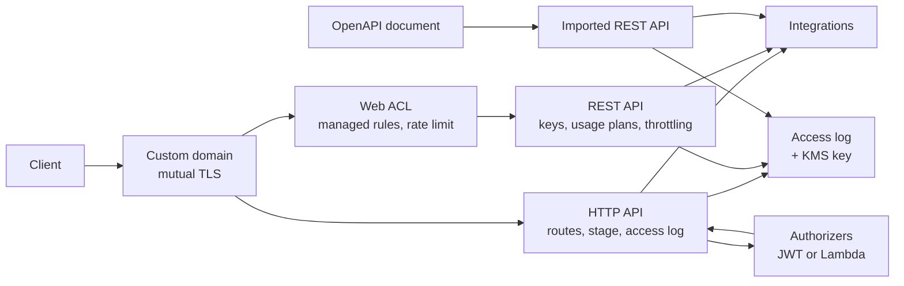

# aws-api-gateway-platform

Terraform for putting an API in front of a workload on AWS: HTTP APIs with
routes and stages, authorizers, usage plans and throttling, WAF protection, an
OpenAPI-driven deployment path, and a custom domain that can require client
certificates.

## Architecture at a glance



Everything except the HTTP API is behind a toggle, and every toggle is off by
default. A web ACL cannot be attached to an HTTP API, API keys and usage plans do
not exist on one, and an API is built either from Terraform resources or from an
imported document but never from both. [`docs/architecture.md`](docs/architecture.md)
explains why each of those is a hard boundary rather than a configuration choice.

## Why this needs a platform rather than a resource

An API Gateway API is easy to create and hard to see. Almost everything that
goes wrong with one is accepted by the service, deployed without an error, and
then returns a status code that does not name its cause:

| What happens | What you see |
|---|---|
| The stage was never told to deploy changes | Routes exist in the console; requests get `{"message":"Not Found"}` |
| API Gateway may not invoke the integration | `{"message":"Internal Server Error"}` and nothing else |
| The payload format the integration expects is not the one it is sent | A handler that throws, or a `200` carrying an error body |
| A catch-all route is present | A misspelled path reaches the backend instead of returning `404` |
| CORS is configured and the backend also sets CORS headers | The backend's headers are discarded; the browser still refuses |
| The integration takes longer than the API's own ceiling | `504` to the client while the work continues, and is billed |
| A protected route lists the scopes a caller needs | Any **one** of them is enough; the list reads as a requirement and is enforced as alternatives |
| Keys, a usage plan and attached clients all exist, and no method demands a key | Every request is served, counted against nothing, and missing from every usage report |
| A throttle names a method path the API does not serve | The setting is stored, reads as though it applies, and limits nothing |
| A method or integration changes without a new deployment | The console shows the change; the stage serves the old snapshot |
| A managed rule group is evaluated in count mode | The ACL is present, its metrics move, and it has never refused a request |
| An imported document has an operation API Gateway could not parse | The import succeeds without it; the route is simply not there |
| An imported operation carries no integration | `{"message":"Internal Server Error"}`, the same as a handler that threw |
| Mutual TLS is on and the generated `execute-api` endpoint still answers | Callers keep working with no certificate; the domain and truststore both check out |
| A new truststore bundle is uploaded to the same S3 key | `apply` reports no changes and the old truststore stays in force; a removed CA is still trusted |
| A certificate in the truststore expires | Nothing reports it, ever |

None of these produce a failed `terraform apply`. The purpose of this repository
is to move as many of them as possible to plan time, and to make the rest
visible in a place an operator will actually look.

## Repository layout

| Path | Contents |
|---|---|
| `versions.tf` | Terraform and provider version constraints |
| `providers.tf` | Regional provider and default tags |
| `variables.tf` | Root inputs |
| `modules/http-api/` | HTTP API, routes, stage and access logging |
| `modules/authorizers/` | JWT and Lambda request authorizers, and a scope-enforcing authorizer function |
| `modules/rest-api/` | REST API, usage plans, API keys, throttling and the web ACL association |
| `modules/waf/` | Regional web ACL, managed rule groups, rate limiting and logging |
| `modules/openapi-api/` | REST API built from an imported OpenAPI document |
| `modules/custom-domain/` | Custom domain name, mutual TLS, base path mappings and DNS |
| `openapi/` | OpenAPI documents imported into the API |
| `tests/` | Offline suite and the standalone document lint gate |
| `docs/` | Architecture and authorization reference |
| `Makefile` | Every gate the pipeline runs, runnable locally |

## Documentation

| Document | Read it for |
|---|---|
| [`docs/architecture.md`](docs/architecture.md) | How the modules compose, what a request meets in order, the two dependency orderings that shape the root, and what the outputs are for |
| [`docs/auth-model.md`](docs/auth-model.md) | Who may call what, what the bundled authorizer checks and in which order, what caching does to token expiry, and why metering is a different question |
| [`modules/*/README.md`](modules) | The contract of one module: inputs, outputs, and the failures it moves to plan time |
| [`tests/README.md`](tests/README.md) | What the suite covers that neither Terraform nor API Gateway does |

## Getting started

Terraform 1.5 or later, and the AWS provider range pinned in `versions.tf`. The
Makefile wraps every gate the pipeline runs, so a local check and a pipeline
check cannot disagree about flags:

```bash
make help          # every target, with what it is for
make init          # root and every module, no backend
make validate      # fmt, then validate per directory
make test          # flake8, py_compile, document lint, pytest
make plan          # requires credentials; nothing above does
make deploy        # plan, confirm, apply
```

`make check` runs everything that needs no credentials, which is what to run
before opening a pull request.

The root configuration deploys one HTTP API with its stage, its access log group
and a customer-managed key for that group. It ships with **no integrations and
no routes**, because every integration names a function or an endpoint owned
outside this configuration and a placeholder default would deploy an API
pointing at an account that does not exist. Supply them:

```hcl
api_name = "orders"

api_integrations = {
  orders = {
    type                 = "AWS_PROXY"
    uri                  = "arn:aws:lambda:us-east-1:123456789012:function:orders"
    timeout_milliseconds = 10000
  }
}

api_routes = {
  list-orders = {
    route_key       = "GET /orders"
    integration_key = "orders"
  }
  get-order = {
    route_key       = "GET /orders/{id}"
    integration_key = "orders"
  }
}

api_cors_configuration = {
  allow_origins = ["https://app.example.com"]
  allow_methods = ["GET", "OPTIONS"]
}
```

To consume a module on its own, pin to a tag. The module interfaces in this
repository are versioned, and `main` is not a stable interface.

```hcl
module "orders_api" {
  source = "github.com/<your-github-org>/aws-api-gateway-platform//modules/http-api?ref=v1.0.0"
  # ...
}
```

## Routing and diagnostics

Two things about an HTTP API decide how most of its problems are experienced.

**Route matching is by priority, not by declaration order.** A route with a
greedy path variable outranks the `$default` catch-all, which is what makes an
`OPTIONS /{proxy+}` route the documented way to let browser preflight requests
past an authorizer. Declaring a `$default` route at all means a misspelled path
reaches a backend rather than returning `404`, so
[`modules/http-api`](modules/http-api) reports every one of them in an output
instead of treating it as ordinary.

**The access log is the only diagnostic surface there is.** An HTTP API has no
execution logging, and every log format the console offers omits the field that
names the cause of a `5xx`. The module ships a format that carries it and
refuses a supplied format that does not. See
[`modules/http-api/README.md`](modules/http-api/README.md) for what each field
distinguishes.

## Authorization

Two kinds of authorizer, and the choice between them is not about cost.

A **JWT authorizer** verifies the token inside the gateway against keys it
fetches from the issuer. Nothing is cached, so a token stops working the moment
it expires. Scopes on such a route are matched **ANY-of**: a route listing three
scopes is granted to a token holding one.

A **Lambda authorizer** calls a function. Declare it with `scope_enforcement`
and this repository deploys its own — a standard-library function that verifies
the signature, pins the algorithm to the published key rather than to the
token's header, requires `exp`, and requires **every** scope configured for the
route.

```hcl
api_jwt_authorizers = {
  workforce = {
    cognito_user_pool_id = "us-east-1_ab12CD34e"
    audience             = ["1example23456789abcdefghij"]
  }
}

api_routes = {
  list-orders = {
    route_key          = "GET /orders"
    integration_key    = "orders"
    authorization_type = "JWT"
    authorizer_key     = "workforce"
  }
}
```

Routes name an authorizer by key rather than by identifier, because an
identifier only exists after an apply. A key that was never declared is refused
at plan time, naming the route and the key.

`scope_enforced_routes` reports which routes require their scopes in full, and
`authorizers_with_cached_results` reports which decisions outlive the token that
produced them. Both exist so the weaker reading is visible rather than assumed.
See [`modules/authorizers/`](modules/authorizers/README.md) for the full
contract, and [`docs/auth-model.md`](docs/auth-model.md) for the model those
inputs express — the order the bundled function checks things in, what caching
does to a token's expiry, and why an API key decides nothing.

## Metered access and protection

Three capabilities have no HTTP API form: **API keys**, **usage plans** and an
**AWS WAF web ACL**. None of them is a setting that can be turned on later, so
an API that has to tell its callers apart, cap them, or sit behind a firewall
is a REST API from the beginning. That is why this repository deploys both
kinds, and why `enable_rest_api` and `enable_waf` are off by default: neither
is useful without integrations to point at, and a web ACL that is not attached
to a stage is a running charge with no effect. `enable_waf` without
`enable_rest_api` is refused at plan time for exactly that reason.

```hcl
enable_rest_api = true
enable_waf      = true

rest_api_methods = {
  list-orders = {
    path        = "/orders"
    http_method = "GET"
    integration = {
      type = "AWS_PROXY"
      uri  = "arn:aws:apigateway:us-east-1:lambda:path/2015-03-31/functions/arn:aws:lambda:us-east-1:123456789012:function:orders/invocations"
    }
  }
}

rest_api_stage_throttle = {
  rate_limit  = 500
  burst_limit = 1000
}

rest_api_keys = {
  partner-a = {}
}

rest_api_usage_plans = {
  standard = {
    api_keys = ["partner-a"]
    throttle = { rate_limit = 50, burst_limit = 100 }
    quota    = { limit = 1000000, period = "MONTH" }
  }
}

waf_enforced_rule_groups        = ["known-bad-inputs"]
waf_rate_limit_per_five_minutes = 3000
```

Two numbers in that example are counted differently, which is the commonest way
a limit turns out not to be the limit anyone meant.

**A usage plan limit is per API key.** One plan rated at 50 requests a second
with twenty keys on it permits a thousand requests a second at the stage, and
adding a twenty-first client raises it again with nothing reconfigured. Only
`rest_api_stage_throttle` bounds the API as a whole;
`plans_above_the_stage_throttle` and
`total_plan_rate_if_every_key_is_at_its_limit` report the comparison. Both
throttles and quotas are best-effort targets rather than guaranteed ceilings,
by AWS's own description.

**A WAF rate limit is per five-minute window.** `3000` above is about ten
requests a second, not three thousand. The window is the service default and is
not adjustable here, because the field that would adjust it does not exist
across the whole provider range this repository pins.

The web ACL ships **observing rather than blocking**: every managed rule group
is evaluated in count mode until it is named in `waf_enforced_rule_groups`.
A group dropped onto live traffic in blocking mode rejects real requests the
first time one of its rules is wrong about one, and which rules are wrong about
which requests is a property of the workload. `waf_rule_groups_not_enforcing`
keeps "behind a WAF" and "can refuse a request" distinguishable. See
[`modules/waf/`](modules/waf/README.md) and
[`modules/rest-api/`](modules/rest-api/README.md).

## Specification-driven deployment

An API can be built two ways here and it has to be one or the other.
[`modules/rest-api/`](modules/rest-api/README.md) declares methods in Terraform
and builds the resource tree from them.
[`modules/openapi-api/`](modules/openapi-api/README.md) hands API Gateway an
OpenAPI document and lets it build the tree. Mixing them means two things
believe they own the same resources, so each apply removes what the other
created and the API alternates between two shapes with no error from either.

Importing makes one word load-bearing. `fail_on_warnings` defaults to **false**
in the service: a document with an unrecognised extension key, an unresolvable
`$ref` or an integration API Gateway cannot parse is imported anyway, minus the
parts it could not understand. The apply succeeds and the operation is not there.
The module defaults it to true and refuses, before the import runs, a document
with an operation carrying no integration, a validator reference naming no
validator, or a placeholder that survived the render.

The document is also where the invocation grants come from. Every integration URI
of the form `functions/<arn>/invocations` is read out of it and compared against
what was granted, so a function the document calls and nothing permits is named
in an output rather than discovered from a `500`. Creating an integration in the
console attaches that grant as a side effect; an import does not.

## Client certificates

Mutual TLS is not a setting on an API. It belongs to the custom domain clients
reach the API through, which puts it in
[`modules/custom-domain/`](modules/custom-domain/README.md) and ties it to two
conditions that are easy to satisfy separately and to miss together.

**The domain must be regional**, because an edge-optimized domain terminates TLS
in a CloudFront distribution API Gateway owns and that cannot ask a client for a
certificate. **The API's generated endpoint must stop answering**, because it
requires no certificate and enabling mutual TLS does not change it — so anything
still holding that URL keeps working while the domain, the truststore and the
certificate all check out. The root configuration refuses that pair unless
`allow_default_endpoint_with_mutual_tls` is set for a migration window, and
reports it for as long as it lasts.

`truststore_version` is a required input, which the service treats as optional.
The provider sends the version only when the configured value changes, so
uploading a new bundle to the same key updates nothing: the domain keeps
validating against the version it was last given, `apply` reports no changes, and
a certificate authority removed from the bundle is still trusted. That call is
also the only time the truststore is inspected at all — API Gateway reports
certificate warnings when a domain is created or updated and never notifies when
a certificate already in it expires.

Four things mutual TLS does not do, each with an output that says so: it does not
check revocation, it does not warn about expiry inside the truststore, it does
not distinguish untrusted from expired from unsupported-algorithm in the `403` it
returns, and it is unavailable on a private API. Revocation checking is a Lambda
authorizer's job — it receives the certificate the client presented — which is
why `modules/openapi-api/` writes the certificate's subject, issuer, serial and
expiry into the access log and deliberately never writes the certificate itself.

## Validation

Every gate runs on a pull request and on `main`, and every one of them runs
locally through the Makefile with the same flags.

| Gate | `make` target | What it is for |
|---|---|---|
| `terraform fmt -check -recursive` | `fmt-check` | Formatting, once, from the root |
| `terraform validate` per directory | `validate` | A fault reported against the directory that owns it, not against the composition that called it |
| `tflint --recursive` | `lint` | Provider-level errors; warnings are reported and do not fail the run |
| `flake8` critical subset | `lint-python` | Syntax errors and undefined names — faults in any style |
| `py_compile` | `lint-python` | The authorizer ships as source and compiles on first invocation, so a syntax error in it is a `500` inside somebody's request |
| `python tests/lint_openapi.py` | `openapi-lint` | Document rules as a standalone gate, so they keep working where no test runner is configured |
| `pytest tests` | `pytest` | What two files have to agree about and nothing enforces |

Nothing in that list needs credentials or a state store, which is what lets it
all run on a pull request from a fork. `terraform validate` runs against the root
as well as every module, because a module validated on its own is given no
variable values — so its `validation` conditions are never evaluated, and a fault
that only appears where the module is called would be reported clean.

## Design principles

- **Refuse at plan time what would otherwise fail silently.** A configuration
  that cannot work is rejected with the reason, rather than applied and left to
  be discovered from a status code.
- **The diagnostic surface is part of the deliverable.** An HTTP API has no
  execution logging at all, so the access log format is the only place a cause
  is ever written down. It is treated as a contract, not a preference.
- **Report what could not be done rather than doing something else.** Where a
  configuration asks for something outside this deployment's reach, the module
  says so in an output instead of silently narrowing the request.
- **Placeholders only.** Account identifiers, domains and ARNs in examples are
  documentation values. Nothing here is written against a real account.
- **Least privilege by construction.** Invocation grants name the route that
  uses them, not the API as a whole.
- **One source of truth per API.** Routing comes either from a document or from
  Terraform, never from both, and where a document and a resource state the same
  property they are required to agree rather than resolved by ordering.

## Versioning

Released tags are the stable interface. `main` is not: module inputs and outputs
change there without notice. Pin a module source to a tag, and read the release
notes before moving between them.

## License

MIT. See [LICENSE](LICENSE).
