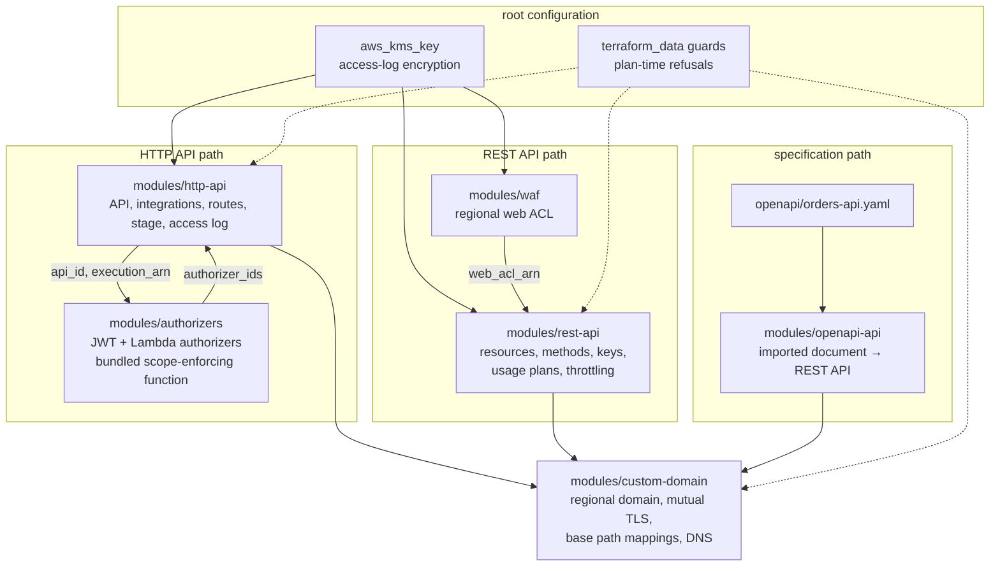
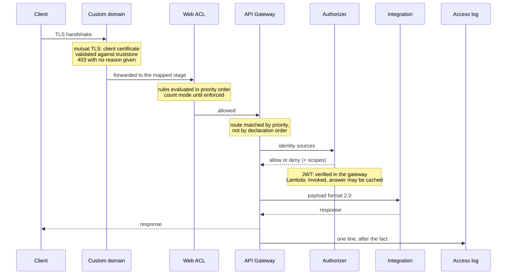

# Architecture

How the pieces in this repository fit together, what each one owns, and where
the boundaries are drawn. The [README](../README.md) says what the platform is
for; this document says how it is built.

## The shape of the problem

API Gateway is two products sharing a console. An **HTTP API** is cheap, fast
and has no API keys, no usage plans, no WAF association and no execution log.
A **REST API** has all four and costs roughly three times as much per million
requests. Which one a workload needs is decided by whether it must tell its
callers apart — and that decision cannot be revised later, because there is no
migration between the two: the resource type is different, the stage is
different, and the integration payload format is different.

So this repository deploys both, behind separate toggles, and refuses the
combinations that cannot work:

| Toggle | Default | What it brings |
|---|---|---|
| — | always on | HTTP API, stage, access log group, log encryption key |
| `enable_rest_api` | `false` | REST API, API keys, usage plans, per-method throttling |
| `enable_waf` | `false` | Regional web ACL, managed rule groups, rate limiting, ACL logging |
| `enable_openapi_api` | `false` | REST API built by importing an OpenAPI document |
| `enable_custom_domain` | `false` | Regional custom domain, mutual TLS, base path mappings, DNS |

`enable_waf` without `enable_rest_api` is rejected at plan time. A regional web
ACL can only be associated with a REST API stage, an Application Load Balancer
or an AppSync API, and an ACL associated with nothing is a running charge that
has never seen a request.

## Composition



The dotted edges are not dependencies. They are `terraform_data` resources whose
`lifecycle.precondition` blocks refuse a configuration the providers would
accept; they are drawn here because they are part of the composition even though
nothing consumes their output.

## Module reference

| Module | Owns | Does not own |
|---|---|---|
| [`http-api`](../modules/http-api/README.md) | `aws_apigatewayv2_api`, integrations, routes, stage, route settings, access log group | Authorizers (they need the API id, which would be a cycle), the functions integrations point at |
| [`authorizers`](../modules/authorizers/README.md) | `aws_apigatewayv2_authorizer` for both kinds, the bundled scope-enforcing function, its role, log group and invoke grants | The routes that reference them |
| [`rest-api`](../modules/rest-api/README.md) | `aws_api_gateway_rest_api`, resource tree, methods, integrations, deployment, stage, API keys, usage plans, throttling, web ACL association | The web ACL itself |
| [`waf`](../modules/waf/README.md) | `aws_wafv2_web_acl`, managed rule group statements, rate-based rule, IP sets, ACL logging | The association — that belongs to whatever is being protected |
| [`openapi-api`](../modules/openapi-api/README.md) | A REST API built from a document body, its deployment, stage, access log group, invocation grants derived from the document | The document |
| [`custom-domain`](../modules/custom-domain/README.md) | `aws_api_gateway_domain_name`, truststore bucket and object, base path mappings, Route 53 records | The certificate, the certificate authority bundle |

Each module is usable on its own. Pin to a tag when you do — `main` is not a
stable interface, and the module inputs in this repository are versioned:

```hcl
module "orders_api" {
  source = "github.com/<your-github-org>/aws-api-gateway-platform//modules/http-api?ref=v1.0.0"
  # ...
}
```

## The request path

What a request meets, in order, and what each stage can do to it.



Four properties of that path decide how most faults are experienced.

**Route matching is by priority.** A route with a greedy path variable outranks
`$default`, which is why an `OPTIONS /{proxy+}` route is the documented way to
let browser preflight past an authorizer. It also means a `$default` route turns
a misspelled path into a call to a backend rather than a `404`, so
`routes_matching_unlisted_paths` reports every one of them.

**The authorizer runs before the integration and inside the request.** Its
timeout is spent on the caller's clock. The bundled function defaults to five
seconds, which is a ceiling, not a budget.

**The access log is written after the response.** It is the only diagnostic
surface an HTTP API has — there is no execution logging — and every log format
the console offers omits `$context.integrationErrorMessage`, the field that
names the cause of a `5xx`. The module ships a format that carries it and
refuses a supplied format that does not.

**CORS is answered by the gateway, not the backend.** When
`api_cors_configuration` is set, API Gateway replaces the CORS headers an
integration returns. A backend that also sets them has them discarded, and the
browser still refuses the response. `integration_cors_headers_discarded` reports
the overlap.

## Two orderings worth knowing about

### The key and the log group

CloudWatch Logs narrows a KMS grant by the *encryption context* of the group
being written to, so the key policy has to name every log group before any of
them exists — and the group cannot be created until the key does. That is a
circle if the group's name is read back from the module.

The root breaks it by deriving the name from an input:

```hcl
access_log_group_name = "/aws/apigateway/${var.api_name}/access"
```

The key then depends only on variables, the group depends on the key, and the
module derives the same name from the same input. The two derivations are
checked against each other by a precondition rather than kept in step by hand.
A group left out of the condition is created successfully and then fails on its
first write, which surfaces as an API with no access log and no error anywhere.

The same derivation covers the REST API's stage log group and the web ACL's, the
latter prefixed `aws-waf-logs-` because AWS WAF refuses a destination whose name
is not.

### The API and its authorizers

The API module produces the id the authorizer module needs; the authorizer
module produces the ids the routes need. Terraform follows the individual values
and orders the work from them.

Adding `depends_on` to either module call breaks this. `depends_on` on a module
call is not a hint about one value — it makes everything inside that module wait
for everything in the target, which closes the two calls into a cycle Terraform
refuses to plan. Routes therefore name an authorizer by **key**, and the root
resolves the key to an identifier:

```hcl
authorizer_id = (
  route.authorizer_key == null
  ? null
  : lookup(module.authorizers.authorizer_ids, route.authorizer_key, null)
)
```

A key that was never declared resolves to `null`, and a precondition rejects it
by naming the route and the key. Without that, the failure is a route deployed
with no authorization at all.

## One source of truth per API

`modules/rest-api` declares methods in Terraform and builds the resource tree
from them. `modules/openapi-api` hands API Gateway a document and lets the
service build the tree. **These cannot both manage one API.** Two things would
believe they own the same resources, each apply would remove what the other
created, and the API would alternate between two shapes with no error from
either. They are separate modules over separate APIs for that reason.

Importing makes `fail_on_warnings` load-bearing. The service defaults it to
`false`: a document with an unrecognised extension key, an unresolvable `$ref`
or an integration API Gateway cannot parse is imported anyway, minus the parts
it could not understand. The apply succeeds and the operation is not there. The
module defaults it to `true`, and refuses before the import runs a document with
an operation carrying no integration, a validator reference naming no validator,
or an unrendered placeholder.

Deployment mode matters as much:

| `openapi_put_rest_api_mode` | Behaviour |
|---|---|
| `overwrite` | The document is the whole API. An operation removed from it is removed from the API. |
| `merge` (default in the service) | The document is added to what is there. An operation removed from the document **stays deployed**, and nothing reports it. |

`openapi_operations_removed_from_the_document_are_left_in_place` exists to make
the second reading visible.

## Terraform validation, not a plan

Every guard in this repository is a `lifecycle.precondition`, a `validation`
block, or a derived output. None of them requires credentials and none of them
requires a plan against real infrastructure, which is what lets the pipeline run
them on a pull request from a fork.

The gates, and what each one is for:

| Gate | Catches |
|---|---|
| `terraform fmt -check -recursive` | Formatting, once, from the root |
| `terraform validate` per directory | A fault reported against the directory that owns it |
| `tflint --recursive` | Provider-level errors; warnings are reported and do not fail |
| `flake8 --select=E9,F63,F7,F82` | Syntax errors and undefined names — faults in any style |
| `py_compile` | The authorizer ships as source and compiles on first invocation, so a syntax error in it is a `500` inside somebody's request |
| `python tests/lint_openapi.py` | Document rules, as a standalone gate that keeps working when no test runner is configured |
| `pytest tests` | What two files have to agree about and nothing enforces |

**Validating a module on its own is not enough.** A module validated alone is
given no variable values, so its `validation` conditions are never evaluated;
the fault appears only where the module is called and a caller leaves a value
unset, which is the default path. That is why the matrix includes `.` as well as
every module, and why the root is the entry that catches it.

Two Terraform behaviours are worth writing down because guards keep being
written against them:

- **`&&` and `||` do not short-circuit.** Terraform evaluates both sides. Only
  the conditional operator `? :` is lazy, so a null guard written
  `x == null || f(x)` still calls `f` with a null and fails on the *argument*
  rather than reporting the guard. Nested conditionals are the safe form, and
  `tests/` scans every `.tf` file for the unsafe one.
- **`can()` and `try()` swallow the error their argument raises**, so a
  condition already inside one of them needs no guard.

## The outputs are the operational surface

Fifty-odd outputs, and most of them report something that is *not* the case.
That is deliberate. Where a configuration asks for something outside this
deployment's reach, the module says so in an output rather than silently
narrowing the request:

| Output | The assumption it breaks |
|---|---|
| `routes_matching_unlisted_paths` | "A misspelled path returns `404`" |
| `lambda_permissions_not_managed` | "The integration is invocable" |
| `integration_cors_headers_discarded` | "The backend's CORS headers are sent" |
| `authorizers_with_cached_results` | "A token stops working when it expires" |
| `scope_enforced_routes` | "Listing three scopes requires three scopes" |
| `methods_not_requiring_an_api_key` | "Traffic is counted against a plan" |
| `plans_above_the_stage_throttle` | "The plan's rate is the API's rate" |
| `total_plan_rate_if_every_key_is_at_its_limit` | "One plan is one limit" |
| `waf_rule_groups_not_enforcing` | "Behind a WAF means it can refuse a request" |
| `waf_rules_shadowed_by_an_earlier_allow` | "Every rule is evaluated" |
| `openapi_functions_without_an_invocation_grant` | "An imported integration can be invoked" |
| `openapi_operations_removed_from_the_document_are_left_in_place` | "The document is the API" |
| `mutual_tls_is_bypassable` | "Client certificates are required" |
| `mutual_tls_does_not_check_revocation` | "A revoked certificate is refused" |
| `mutual_tls_truststore_expiry_not_notified` | "Something watches the truststore" |

Read them after an apply. An output naming an empty list is the assertion that
the assumption holds; an output naming anything is a finding.

## Design principles

- **Refuse at plan time what would otherwise fail silently.** A configuration
  that cannot work is rejected with its reason rather than applied and left to
  be discovered from a status code.
- **The diagnostic surface is part of the deliverable.** The access log format
  is a contract, not a preference.
- **Report what could not be done rather than doing something else.**
- **Placeholders only.** Account identifiers, domains and ARNs in examples are
  documentation values.
- **Least privilege by construction.** Invocation grants name the route that
  uses them, not the API as a whole.
- **One source of truth per API.** Routing comes from a document or from
  Terraform, never from both.
